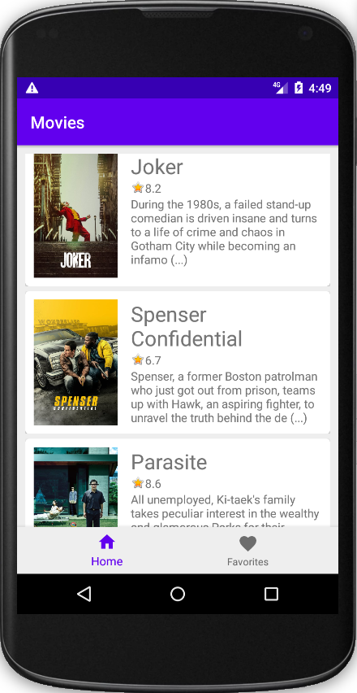
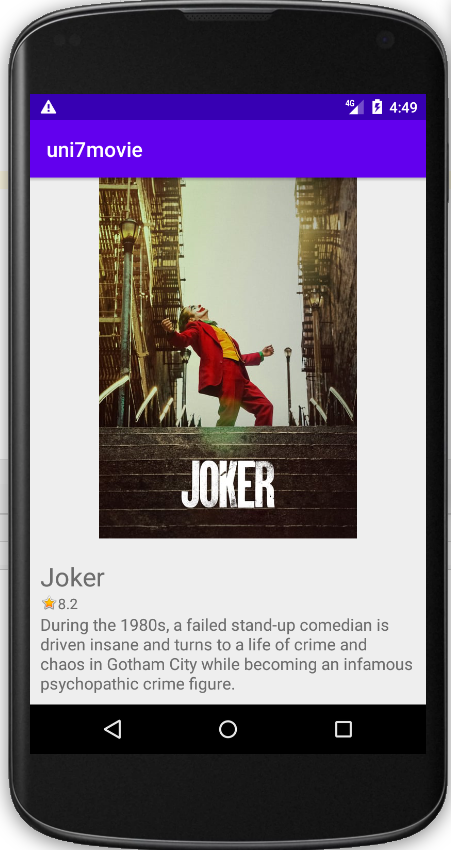

# uni7movie

Android App for post graduate couse.

This project is for academic use only. I do not recommend use in production.

## Installation
Clone this repository and import into **Android Studio**
```bash
git clone git@github.com:nielsenteixeira/android-favorite-movies.git
```
## About Movies

The app list top rated movies from [TheMovieDB](https://www.themoviedb.org/documentation/api) Api

## Samples

#### Movies List



#### Selected Movie



